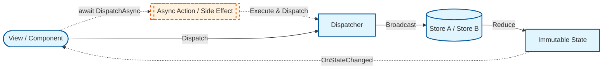

# TtwSDK.Redux

**A lightweight, thread-safe Redux implementation for C# with built-in Thunk support.**

`TtwSDK.Redux` is a predictable state container for .NET applications. It helps you write applications that behave consistently, run in different environments (Client, Server, and Native), and are easy to test.

It is designed to be framework-agnostic, making it a perfect choice for **Blazor**, **Unity**, or any generic .NET application.

---

## What is Redux?

Redux is a pattern and library for managing and updating application state, using events called "actions". It serves as a centralized store for state that needs to be used across your entire application, with rules ensuring that the state can only be updated in a predictable fashion.

Key Principles:

- **Single Source of Truth**: The state of your whole application is stored in an object tree within a single store.
    - **Note**: However, `TtwSDK.Redux` supports multiple stores, resembling the Flux pattern more closely in this aspect.
- **State is Read-Only**: The only way to change the state is to emit an action, an object describing what happened.
- **Changes are made with Pure Functions**: To specify how the state tree is transformed by actions, you write pure reducers.

## Features in TtwSDK.Redux

- **Decoupled Architecture**: The View layer only depends on `IReadOnlyStore` (for reading state) and `IDispatcher` (for dispatching actions). It handles the "What" (State) but delegates the "How" (Update logic) to Reducers.
- **Smart Observation**: Includes a `StateObserver` that handles diffing, reducing unnecessary UI repaints.
- **Multi-Store Support**: A single Dispatcher can manage multiple stores (e.g., `UserStore`, `GameStore`). This allows for modular state management while keeping a unified data flow.
- **Thread Safety**: The Store utilizes strict locking to prevent race conditions during state reduction.
- **Reducer Composition & Slicing**: Includes helper methods (`Slice`, `Compose`) to break down complex reducers into smaller, manageable functions that operate on specific parts of the state tree.
- **Framework Agnostic & Adaptable**: The core logic is pure C#. Developers can implement custom **Adapters** (with `StateObserver`) to easily integrate with **Blazor**, **Unity**, or **Godot**.
- **Built-in Thunk Middleware**: Native support for `IAsyncAction` to handle asynchronous logic (API calls, delays).

## Architecture & Design

- **Core (`TtwSDK.Redux.Core`)**: Contains the pure Redux implementation (`IStore`, `Dispatcher`, `IAction`). It has zero dependencies on the Task Parallel Library (TPL) for state updates, ensuring operations are synchronous and atomic.
- **Thunks (`TtwSDK.Redux.Thunks`)**: An extension layer that introduces `IAsyncAction` and `DispatcherExtensions`. This allows for handling async operations without polluting the core logic.

### The Data Flow

The following diagram illustrates how `TtwSDK.Redux` handles both synchronous actions and asynchronous side effects (Thunks):



## Why Redux?

Managing state in complex applications can quickly become chaotic. Redux offers a structured way to handle data flow. It is particularly useful for:

- **Web Applications (e.g. Blazor)**: Managing complex UI states, forms, and cross-component communication without "prop drilling".
- **Game UI Systems**: Handling inventories, skill trees, or quest logs where data consistency is crucial.
- **Or, building Room Escape Games?** Actually that’s why I made this framework, I found it fits perfectly for managing puzzle states, locked doors, and inventory items.

## Prerequisites

- .NET 8.0 SDK or later (Nullable reference types enabled)

## Getting Started

### 1. Define State

Create an immutable record for state.

```csharp
public record MyState(int Count);
```

### 2. Define Actions

Create actions to describe what happens.

```csharp
public record IncrementAction : IAction;
```

### 3. Create a Reducer

Write a pure function to handle state transitions.

```csharp
public static class MyReducer
{
    public static MyState Reduce(MyState state, IAction action)
    {
        return action switch
        {
            IncrementAction => state with { Count = state.Count + 1 },
            _ => state
        };
    }
}
```

### 4. Setup (Dependency Injection Recommended)

In your application entry point (e.g., `Program.cs`), setup the `Dispatcher` and `Stores`.

**Note**: Views should inject `IReadOnlyStore<T>` to enforce the unidirectional data flow, preventing them from modifying state directly without an action.

```csharp
using TtwSDK.Redux.Core;

// 1. Create the concrete Dispatcher first
var dispatcher = new Dispatcher();

// 2. Create the Store with initial state and reducer
var store = new Store<MyState>(
    new MyState(0),
    MyReducer.Reduce
);

// 3. Register the store to the dispatcher
dispatcher.AddStore(store);

// 4. If you are using a DI container, remember to register Dispatcher and IReadOnlyStore
// This is a DI example from Blazor:
// builder.Services.AddSingleton<IDispatcher>(dispatcher);
// builder.Services.AddSingleton<IReadOnlyStore<MyState>>(store);
```

## Basic Usage: StateObserver

The `StateObserver` is the bridge between your State and your UI. It handles subscription lifecycle (`IDisposable`) and ensures your UI only updates when the specific data you care about actually changes (Diffing).

### Features of `Observe`:

1. **Returns the current value** immediately (useful for initialization).
2. **Accepts a callback** that runs whenever the value changes.
3. **Triggers a global callback** (optional) to signal the UI framework to repaint.

```csharp
// Example in a generic class
var observer = new StateObserver();

// Observe returns the current value immediately
int currentCount = observer.Observe(
    store, 
    state => state.Count, 
    newCount => Console.WriteLine($"Count changed to: {newCount}")
);
```

## Framework Integration

To reduce boilerplate, it is recommended to create a Base Component (or "Connector") for your specific framework.

### 1. Blazor Integration (`ReduxComponent`)

In Blazor, we want to automatically trigger `StateHasChanged` whenever any observed value changes.

**Create the Base Component:**

```csharp
using Microsoft.AspNetCore.Components;
using TtwSDK.Redux.Core;

public abstract class ReduxComponent : ComponentBase, IDisposable
{
    [Inject] protected IDispatcher Dispatcher { get; set; } = default!;

    private StateObserver? _observer;
    
    // Lazy initialization ensures StateHasChanged is bound to the correct context
    private StateObserver Observer => 
        _observer ??= new StateObserver(() => InvokeAsync(StateHasChanged));

    /// <summary>
    /// Subscribes to state changes and updates the local value automatically.
    /// </summary>
    protected TValue Observe<TState, TValue>(
        IReadOnlyStore<TState> store, 
        Func<TState, TValue> selector, 
        Action<TValue> onValueChanged)
    {
        // 1. Subscribe to the store
        var initialValue = Observer.Observe(store, selector, onValueChanged);
        
        // 2. Manually trigger the callback once to initialize the local variable
        onValueChanged(initialValue);
        
        return initialValue;
    }

    protected void Dispatch(IAction action) => Dispatcher.Dispatch(action);
    
    public virtual void Dispose() => _observer?.Dispose();
}
```

**Usage in a Blazor View:**

You simply bind the Store state to your local field in `OnInitialized`.

```csharp
@inherits ReduxComponent
@inject IReadOnlyStore<MyState> Store

<h3>Count: @_count</h3>
<button @onclick="Increment">Increment</button>

@code {
    private int _count;

    protected override void OnInitialized()
    {
        // "Bind" the local _count field to Store.State.Count
        Observe(Store, 
            state => state.Count, 
            val => _count = val
        );
        
        // You can observe multiple states here...
    }

    void Increment() => Dispatch(new IncrementAction());
}
```

### 2. Unity Integration (`ReduxBehaviour`)

In Unity, we typically update UI elements (like `Text` or `Slider`) directly in the callback.

**Create the Base Behaviour:**

```csharp
using UnityEngine;
using UnityEngine.UI;
using TtwSDK.Redux.Core;

public abstract class ReduxBehaviour : MonoBehaviour
{
    protected IDispatcher Dispatcher;
    private StateObserver _observer;

    // Call this from your Composition Root / DI Setup
    public void Init(IDispatcher dispatcher)
    {
        Dispatcher = dispatcher;
        
        // In Unity Runtime, the Game Loop handles continuous rendering, so a global 'Repaint' signal
        // (like Blazor's StateHasChanged) is generally not needed.
        // We pass null unless we are in a special context (e.g., EditorWindow) that requires manual dirty marking.
        _observer = new StateObserver();
        OnSetup();
    }

    protected abstract void OnSetup();

    protected TValue Observe<TState, TValue>(
        IReadOnlyStore<TState> store, 
        Func<TState, TValue> selector, 
        Action<TValue> onValueChanged)
    {
        var val = _observer.Observe(store, selector, onValueChanged);
        onValueChanged(val); // Initialize UI immediately
        return val;
    }

    private void OnDestroy() => _observer?.Dispose();
}
```

**Usage in a Unity Script:**

```csharp
public class CounterView : ReduxBehaviour
{
    [SerializeField] Text _counterText;
    
    // Injected via VContainer/Zenject or assigned manually
    private IReadOnlyStore<MyState> _store; 

    protected override void OnSetup()
    {
        // Subscribe to Score
        Observe(_store, 
            state => state.Count, 
            count => _counterText.text = $"Count: {count}"
        );
        
        // You can Observe multiple states here...
    }
}
```

---

## Advanced: Async Actions (Thunks)

Standard actions are just data. Sometimes you need to execute logic that involves **side effects** (e.g., API calls, delays) or requires access to the **current state** (e.g., checking `IsLoading` before sending a request).

`TtwSDK.Redux` supports this via `IAsyncAction`.

> Design Note: GetState is provided on the Dispatcher specifically for Thunks. The returned State is read-only (assuming you use records/immutable types), ensuring safety.
> 

### Example: Async Fetch with State Check

```csharp
using TtwSDK.Redux.Thunks; // Required for IAsyncAction

public class FetchUserDataAsyncAction : IAsyncAction
{
    public async Task Execute(IDispatcher dispatcher)
    {
        // 1. Access Current State via Dispatcher
        var state = dispatcher.GetState<MyState>();
        
        if (state.IsLoading) return; // Logic: Prevent duplicate requests

        // 2. Dispatch Synchronous Action (Start)
        dispatcher.Dispatch(new SetLoadingAction(true));

        try 
        {
            // 3. Perform Async Operation
            await Task.Delay(1000); 
            dispatcher.Dispatch(new SetUserAction("Terry"));
        }
        finally 
        {
            // 4. Ensure state is reset
            dispatcher.Dispatch(new SetLoadingAction(false));
        }
    }
}
```

### Integration Tip: Enhancing Your Base Component

If you are using the **Base Component** pattern (like the `ReduxComponent` or `ReduxBehaviour` created earlier), you can now add a helper method to support Thunks easily.

**Update your Base Component:**

```csharp
using TtwSDK.Redux.Thunks; // 1. Add namespace

public abstract class ReduxComponent : ComponentBase, IDisposable
{
    // ... existing code (Observer, Observe, Dispatch) ...

    // 2. Add this helper method for Async Actions
    protected async Task DispatchAsync(IAsyncAction action) 
    {
        await Dispatcher.DispatchAsync(action);
    }
}
```

### Usage

Now your components can simply call `await DispatchAsync(new MyThunk());`

```csharp
// In a View or logic class
await dispatcher.DispatchAsync(new FetchUserDataAsyncAction());
```

## How about R3 or ReactiveProperty?

I intentionally designed the core of `TtwSDK.Redux` to be dependency-free (Pure C# events). However, if we integrate Reactive libraries like **R3**, or **ReactiveProperty,** implementation might be simplified.

## References

- [Redux](https://redux.js.org/)
- [Redux Thunk](https://github.com/reduxjs/redux-thunk)

## License

This project is licensed under the MIT License. See the `LICENSE` file for details.